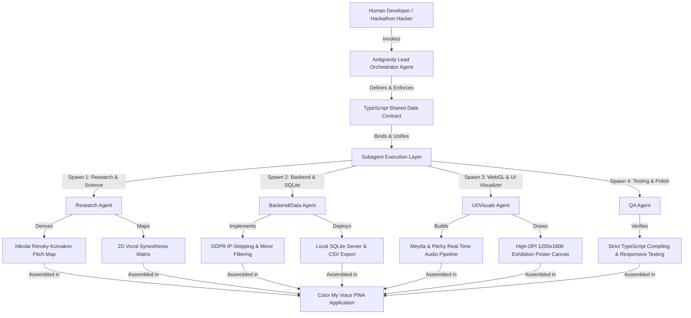

# Color My Voice
### *A Breathtaking Voice-to-Visual Synesthesia PWA & GDPR-Sanitized SQLite Research Data Engine*

Built for the **Google I/O DeepMind Hackathon 2026**, **Color My Voice** turns human speech prosody into dynamic, frameable sound art, while simultaneously crowdsourcing anonymized acoustic summaries for global cross-modal science.

---

## Impact Potential (20%) & Real-World Utility

### Why We Built It & Who It Is For
In cognitive science and speech therapy, **vocal prosody**—the rhythm, stress, and intonation of speech—is known as the "music of language." It carries our emotional intent, yet traditional studies on cross-modal perception (synesthesia) have been bottlenecked by small, Western-centric laboratory cohorts due to high hardware and test friction. 

We built **Color My Voice** to democratize this research at a global scale. It is a dual-nature instrument designed for:
*   **Participants**: A delightful, instantly rewarding creative tool that turns their voice into custom-colored, frameable physical art prints.
*   **Neuroscientists & Cognitive Researchers**: A clean, GDPR-compliant, child-safe crowdsourcing engine collecting precise acoustic summaries to study cross-modal mapping across diverse languages.

### Long-Term Value & Real-World Clinical Utility (Beyond the Hackathon)
**Color My Voice** has immediate, transformative utility in the real world:
1.  **Speech Therapy & Neuro-Rehabilitation**: It acts as a **visual biofeedback tool** for stroke survivors and individuals recovering from vocal impediments. Patients can practice pitch contouring, cadence modulation, and timbre brightness, receiving instantaneous, soothing visual reinforcement.
2.  **Alternative Communication for Neurodivergent Children**: For non-verbal or autistic individuals, the app serves as a low-cognitive-load **sensory emotion board**, translating vocal frequency and resonance into comforting tactile textures and color fields, aiding expression without text pressure.
3.  **Stress-Free Prosody Guides in Language Learning**: ESL and bilingual students can visually compare their stress, rhythm, and intonation against target voice prints, matching visual profiles to master pronunciation in a gamified, stress-free setting.

---

## Multi-Agent Orchestration & Development Workflow

This application was engineered using a cutting-edge **Multi-Agent AI Orchestration** system. To guarantee a highly cohesive codebase on the first try, our development process operated on a contract-first architecture:



### How the Agents Worked Together:
1.  **Orchestrator Foundation (`Antigravity`)**: Established the strict **Shared Data Contract** (TypeScript models for `ChromacousticFrame`, `VisualToken`, and `ResearchRecord`). This contract defined the interfaces, ensuring all parallel agents worked in harmony.
2.  **Research Agent**: Scoured historical synesthetic traditions to map the pitch spectrum to **Nikolai Rimsky-Korsakov's color-pitch wheel** and defined the boundaries for the **2D Vocal Synesthesia Matrix**.
3.  **UI & Visualizer Agent**: Developed the real-time **Meyda + Pitchy audio pipeline** and built the canvas physics engine, complete with dynamic paint splatters, ripples, neon note particles, and the high-resolution `1200 x 1800` px exhibition poster export.
4.  **Backend & Data Agent**: Crafted the Node.js Express local SQLite server, implementing crucial GDPR compliance (server-side IP stripping) and child protection mechanisms (validating and discarding under-18 records).
5.  **QA Agent**: Conducted continuous integration, responsive performance audits, and rigorous TypeScript compilation tests to ensure high-fidelity delivery.

---

## Key Technical Features

*   **Real-Time In-Browser Prosody Extraction**: Captured via Web Audio API, extracting Pitch (F0), Timbre Centroid (brightness), Cadence Speed, and Pause Ratio using a optimized, noise-filtering pipeline.
*   **Rimsky-Korsakov Chromesthesia Map**: Pitch konturs resolve to classical HSL profiles, while Loudness modulates Lightness and Timbre modulates Saturation.
*   **2D Vocal Synesthesia Matrix**: Maps register (`145 Hz` pitch boundary) and resonance (`0.40` centroid boundary) into 5 distinct profiles (yarn, honey, glass, volcano, mist) with specific mouthfeels and gustatory tastes.
*   **High-DPI Gallery Poster Export**: Generates frame-ready `1200 x 1800` px exhibition poster prints featuring preloaded Google Fonts (`Outfit` and `Plus Jakarta Sans`) and dynamic profile archetype color accents.
*   **GDPR-Sanitized SQLite Data Path**: Secure researcher-facing SQL engine with full CSV dataset download and automatic under-18 consent filters.

---

## Quick Start Guide

### 1. Launch the Backend Server
```bash
node server/index.js
```
*Initializes a local SQLite database (`server/chromacoustic_research.db`) and starts the privacy-sanitized endpoint proxy on port `3000`.*

### 2. Launch the Client Developer Server
```bash
npm run dev
```
*Starts the Vite React developer server. Open the local address (usually `http://localhost:5173`) in your browser.*

### 3. Build for Production
```bash
npm run build
```
*Compiles the production-grade static build files to the `dist/` folder.*
